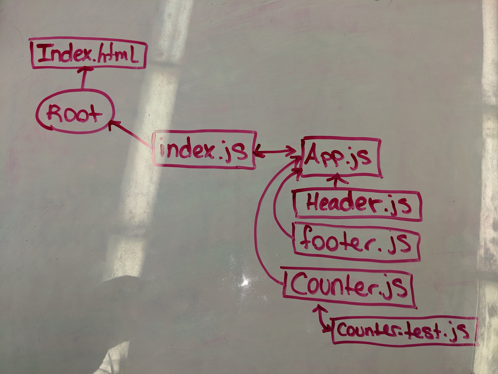

# LAB 27
## React Testing and Deployment
### Author: Natalie Alway
### **Links and Resources**
* [submission PR](https://github.com/nataliealway-401-advanced-javascript/lab-27-react-deployment/pull/1) 
* [travis](https://www.travis-ci.com/nataliealway-401-advanced-javascript/lab-27-react-deployment)
* [AWS Amplify](https://workingbranch.d1lji1gqvjkoy3.amplifyapp.com/)

### **Components**
* `<Header />`
* `<Footer />`
* `<Counter />`

### How to initialize/run your server app (where applicable)
* 'npm run'

### **Tests**
* 'npm test'
### UML
